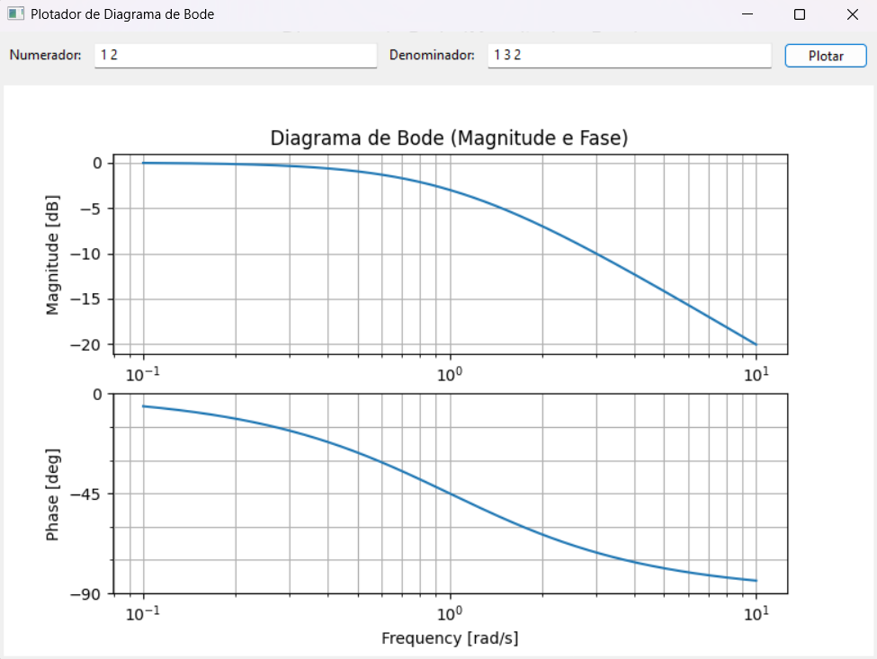

## Plotador de diagramas de Bode
Interface para plotar Diagramas de Bode usando as funções da biblioteca *Control*.



Basta digitar o numerador e o denominador da função de transferência e clicar em ```Plotar```.

> [Como executar o código](#como-rodar-o-projeto).
## Tecnologias
* __Control__: Biblioteca com funções para sistema de controle.
* __Matplotlib__: Utilizada na geração dos grafos.
* __wxPython__: Para a construção da interface.
## Como rodar o projeto:
1. Clone o repositório:
    ```
    git clone https://github.com/Enio-Antonio/bode-ploter
    ```
1. Crie um ambiente virtual (recomendado):
    ```
    python -m venv .venv
    ./.venv/Scripts/Activate.ps1
    ```
1. Instale as depedências:
    ```
    pip install -r requirements.txt
    ```
1. Execute o scripts:
    ```
    python ploter.py
    ```
## Futuras implementações
* Diagrama polar
* Plot das assíntotas
* Arquivo .exe
